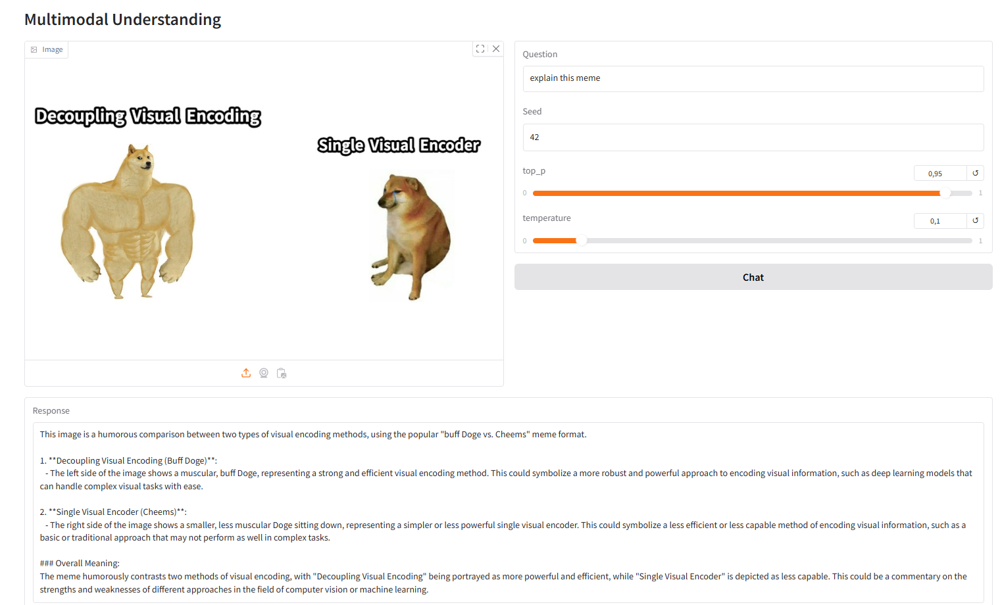
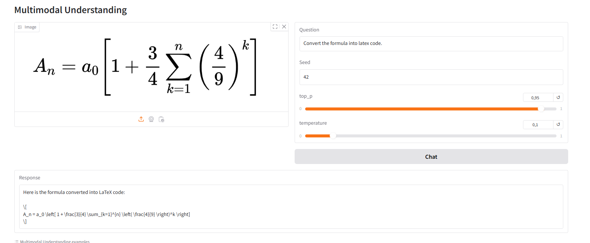
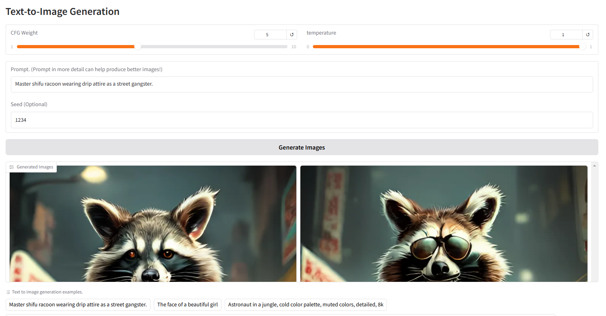

# Janus-Pro: A Unified Multimodal Understanding and Generation Framework

## Introduction

In the rapidly evolving field of artificial intelligence, the ability to understand and generate multimodal content—such as images and text—has become increasingly important. **Janus-Pro** is a novel autoregressive framework that unifies multimodal understanding and generation, addressing the limitations of previous approaches. By decoupling visual encoding into separate pathways, Janus-Pro enhances flexibility and performance, making it a strong candidate for next-generation unified multimodal models.

This blog will delve into the architecture, key features, and applications of Janus-Pro, providing a comprehensive understanding of its capabilities. We will also explore the mathematical foundations and equations that underpin this model, and conclude with a practical implementation using `app.py` to demonstrate its functionality.

## Model Summary

Janus-Pro is a unified multimodal understanding and generation model that decouples visual encoding for both tasks. It is built on the **DeepSeek-LLM-1.5b-base** or **DeepSeek-LLM-7b-base** language models. For multimodal understanding, Janus-Pro employs the **SigLIP-L** vision encoder, which supports 384 x 384 image inputs. For image generation, it uses a tokenizer with a downsample rate of 16.

### Key Features:
- **Decoupled Visual Encoding**: Separates the visual encoding pathways for understanding and generation, reducing conflicts and enhancing flexibility.
- **Unified Transformer Architecture**: Utilizes a single transformer architecture for processing, simplifying the model while maintaining high performance.
- **State-of-the-Art Performance**: Matches or exceeds the performance of task-specific models in both understanding and generation tasks.

## Mathematical Foundations

### Autoregressive Modeling

Janus-Pro is an autoregressive model, meaning it generates sequences one element at a time, using the previously generated elements as context. The probability of a sequence \( \mathbf{x} = (x_1, x_2, \dots, x_T) \) is given by:

\[
P(\mathbf{x}) = \prod_{t=1}^{T} P(x_t | x_{<t})
\]

where \( x_{<t} \) represents all elements before time step \( t \).

### Multimodal Understanding

For multimodal understanding, Janus-Pro processes both text and image inputs. Given an image \( \mathbf{I} \) and a text prompt \( \mathbf{T} \), the model computes the joint probability:

\[
P(\mathbf{T}, \mathbf{I}) = P(\mathbf{T} | \mathbf{I}) \cdot P(\mathbf{I})
\]

The vision encoder \( f_{\text{vision}} \) encodes the image into a latent representation \( \mathbf{z}_I \):

\[
\mathbf{z}_I = f_{\text{vision}}(\mathbf{I})
\]

The text encoder \( f_{\text{text}} \) encodes the text into a latent representation \( \mathbf{z}_T \):

\[
\mathbf{z}_T = f_{\text{text}}(\mathbf{T})
\]

These representations are then fused in the transformer to produce the final output.

### Image Generation

For image generation, Janus-Pro uses a similar autoregressive approach. Given a text prompt \( \mathbf{T} \), the model generates an image \( \mathbf{I} \) by sampling from the conditional distribution:

\[
P(\mathbf{I} | \mathbf{T}) = \prod_{t=1}^{T} P(\mathbf{I}_t | \mathbf{I}_{<t}, \mathbf{T})
\]

The image is generated in a patch-wise manner, where each patch is conditioned on the previous patches and the text prompt.

### Loss Functions

The model is trained using a combination of cross-entropy loss for text generation and mean squared error (MSE) for image generation:

\[
\mathcal{L}_{\text{text}} = -\sum_{t=1}^{T} \log P(x_t | x_{<t})
\]

\[
\mathcal{L}_{\text{image}} = \frac{1}{N} \sum_{i=1}^{N} (\mathbf{I}_i - \hat{\mathbf{I}}_i)^2
\]

where \( \hat{\mathbf{I}}_i \) is the generated image patch and \( \mathbf{I}_i \) is the ground truth.

## Practical Implementation

To demonstrate the capabilities of Janus-Pro, we will use a Gradio interface to create a web application that allows users to interact with the model. Below is the `app.py` script that integrates the model and provides a user-friendly interface for multimodal understanding and image generation.

```python
import gradio as gr
import torch
from transformers import AutoConfig, AutoModelForCausalLM
from janus.models import MultiModalityCausalLM, VLChatProcessor
from janus.utils.io import load_pil_images
from PIL import Image
import numpy as np
import os
import time
from Upsample import RealESRGAN
import spaces  # Import spaces for ZeroGPU compatibility

# Load model and processor
model_path = "deepseek-ai/Janus-Pro-7B"
config = AutoConfig.from_pretrained(model_path)
language_config = config.language_config
language_config._attn_implementation = 'eager'
vl_gpt = AutoModelForCausalLM.from_pretrained(model_path,
                                             language_config=language_config,
                                             trust_remote_code=True)

if torch.cuda.is_available():
    vl_gpt = vl_gpt.to(torch.bfloat16).cuda()
else:
    vl_gpt = vl_gpt.to(torch.float16)

vl_chat_processor = VLChatProcessor.from_pretrained(model_path)
tokenizer = vl_chat_processor.tokenizer
cuda_device = 'cuda' if torch.cuda.is_available() else 'cpu'

# SR model
sr_model = RealESRGAN(torch.device('cuda' if torch.cuda.is_available() else 'cpu'), scale=2)
sr_model.load_weights(f'weights/RealESRGAN_x2.pth', download=False)

@torch.inference_mode()
@spaces.GPU(duration=120)  # Multimodal Understanding function
def multimodal_understanding(image, question, seed, top_p, temperature):
    # Clear CUDA cache before generating
    torch.cuda.empty_cache()
    
    # set seed
    torch.manual_seed(seed)
    np.random.seed(seed)
    torch.cuda.manual_seed(seed)
    
    conversation = [
        {
            "role": "<|User|>",
            "content": f"<image_placeholder>\n{question}",
            "images": [image],
        },
        {"role": "<|Assistant|>", "content": ""},
    ]
    
    pil_images = [Image.fromarray(image)]
    prepare_inputs = vl_chat_processor(
        conversations=conversation, images=pil_images, force_batchify=True
    ).to(cuda_device, dtype=torch.bfloat16 if torch.cuda.is_available() else torch.float16)
        
    inputs_embeds = vl_gpt.prepare_inputs_embeds(**prepare_inputs)
    
    outputs = vl_gpt.language_model.generate(
        inputs_embeds=inputs_embeds,
        attention_mask=prepare_inputs.attention_mask,
        pad_token_id=tokenizer.eos_token_id,
        bos_token_id=tokenizer.bos_token_id,
        eos_token_id=tokenizer.eos_token_id,
        max_new_tokens=512,
        do_sample=False if temperature == 0 else True,
        use_cache=True,
        temperature=temperature,
        top_p=top_p,
    )
    
    answer = tokenizer.decode(outputs[0].cpu().tolist(), skip_special_tokens=True)
    return answer

def generate(input_ids,
             width,
             height,
             temperature: float = 1,
             parallel_size: int = 5,
             cfg_weight: float = 5,
             image_token_num_per_image: int = 576,
             patch_size: int = 16):
    # Clear CUDA cache before generating
    torch.cuda.empty_cache()
    
    tokens = torch.zeros((parallel_size * 2, len(input_ids)), dtype=torch.int).to(cuda_device)
    for i in range(parallel_size * 2):
        tokens[i, :] = input_ids
        if i % 2 != 0:
            tokens[i, 1:-1] = vl_chat_processor.pad_id
    inputs_embeds = vl_gpt.language_model.get_input_embeddings()(tokens)
    generated_tokens = torch.zeros((parallel_size, image_token_num_per_image), dtype=torch.int).to(cuda_device)
    pkv = None
    for i in range(image_token_num_per_image):
        with torch.no_grad():
            outputs = vl_gpt.language_model.model(inputs_embeds=inputs_embeds,
                                                use_cache=True,
                                                past_key_values=pkv)
            pkv = outputs.past_key_values
            hidden_states = outputs.last_hidden_state
            logits = vl_gpt.gen_head(hidden_states[:, -1, :])
            logit_cond = logits[0::2, :]
            logit_uncond = logits[1::2, :]
            logits = logit_uncond + cfg_weight * (logit_cond - logit_uncond)
            probs = torch.softmax(logits / temperature, dim=-1)
            next_token = torch.multinomial(probs, num_samples=1)
            generated_tokens[:, i] = next_token.squeeze(dim=-1)
            next_token = torch.cat([next_token.unsqueeze(dim=1), next_token.unsqueeze(dim=1)], dim=1).view(-1)
            img_embeds = vl_gpt.prepare_gen_img_embeds(next_token)
            inputs_embeds = img_embeds.unsqueeze(dim=1)
        patches = vl_gpt.gen_vision_model.decode_code(generated_tokens.to(dtype=torch.int),
                                                 shape=[parallel_size, 8, width // patch_size, height // patch_size])
    return generated_tokens.to(dtype=torch.int), patches

def unpack(dec, width, height, parallel_size=5):
    dec = dec.to(torch.float32).cpu().numpy().transpose(0, 2, 3, 1)
    dec = np.clip((dec + 1) / 2 * 255, 0, 255)
    visual_img = np.zeros((parallel_size, width, height, 3), dtype=np.uint8)
    visual_img[:, :, :] = dec
    return visual_img

@torch.inference_mode()
@spaces.GPU(duration=120)  # Specify a duration to avoid timeout
def generate_image(prompt,
                   seed=None,
                   guidance=5,
                   t2i_temperature=1.0):
    # Clear CUDA cache and avoid tracking gradients
    torch.cuda.empty_cache()
    # Set the seed for reproducible results
    if seed is not None:
        torch.manual_seed(seed)
        torch.cuda.manual_seed(seed)
        np.random.seed(seed)
    width = 384
    height = 384
    parallel_size = 5
    
    with torch.no_grad():
        messages = [{'role': '<|User|>', 'content': prompt},
                    {'role': '<|Assistant|>', 'content': ''}]
        text = vl_chat_processor.apply_sft_template_for_multi_turn_prompts(conversations=messages,
                                                                   sft_format=vl_chat_processor.sft_format,
                                                                   system_prompt='')
        text = text + vl_chat_processor.image_start_tag
        
        input_ids = torch.LongTensor(tokenizer.encode(text))
        output, patches = generate(input_ids,
                                   width // 16 * 16,
                                   height // 16 * 16,
                                   cfg_weight=guidance,
                                   parallel_size=parallel_size,
                                   temperature=t2i_temperature)
        images = unpack(patches,
                        width // 16 * 16,
                        height // 16 * 16,
                        parallel_size=parallel_size)
        # return [Image.fromarray(images[i]).resize((768, 768), Image.LANCZOS) for i in range(parallel_size)]
        stime = time.time()
        ret_images = [image_upsample(Image.fromarray(images[i])) for i in range(parallel_size)]
        print(f'upsample time: {time.time() - stime}')
        return ret_images

@spaces.GPU(duration=60)
def image_upsample(img: Image.Image) -> Image.Image:
    if img is None:
        raise Exception("Image not uploaded")
        
    width, height = img.size
    
    if width >= 5000 or height >= 5000:
        raise Exception("The image is too large.")
    global sr_model
    result = sr_model.predict(img.convert('RGB'))
    return result
    
# Gradio interface
with gr.Blocks() as demo:
    gr.Markdown(value="# Multimodal Understanding")
    with gr.Row():
        image_input = gr.Image()
        with gr.Column():
            question_input = gr.Textbox(label="Question")
            und_seed_input = gr.Number(label="Seed", precision=0, value=42)
            top_p = gr.Slider(minimum=0, maximum=1, value=0.95, step=0.05, label="top_p")
            temperature = gr.Slider(minimum=0, maximum=1, value=0.1, step=0.05, label="temperature")
            understanding_button = gr.Button("Chat")
    understanding_output = gr.Textbox(label="Response")
    examples_inpainting = gr.Examples(
        label="Multimodal Understanding examples",
        examples=[
            [
                "explain this meme",
                "doge.png",
            ],
            [
                "Convert the formula into latex code.",
                "equation.png",
            ],
        ],
        inputs=[question_input, image_input],
    )
                
    gr.Markdown(value="# Text-to-Image Generation")
            
    with gr.Row():
        cfg_weight_input = gr.Slider(minimum=1, maximum=10, value=5, step=0.5, label="CFG Weight")
        t2i_temperature = gr.Slider(minimum=0, maximum=1, value=1.0, step=0.05, label="temperature")
    prompt_input = gr.Textbox(label="Prompt. (Prompt in more detail can help produce better images!)")
    seed_input = gr.Number(label="Seed (Optional)", precision=0, value=1234)
    generation_button = gr.Button("Generate Images")
    image_output = gr.Gallery(label="Generated Images", columns=2, rows=2, height=300)
    examples_t2i = gr.Examples(
        label="Text to image generation examples.",
        examples=[
            "Master shifu racoon wearing drip attire as a street gangster.",
            "The face of a beautiful girl",
            "Astronaut in a jungle, cold color palette, muted colors, detailed, 8k",
            "A cute and adorable baby fox with big brown eyes, autumn leaves in the background enchanting,immortal,fluffy, shiny mane,Petals,fairyism,unreal engine 5 and Octane Render,highly detailed, photorealistic, cinematic, natural colors.",
            "The image features an intricately designed eye set against a circular backdrop adorned with ornate swirl patterns that evoke both realism and surrealism. At the center of attention is a strikingly vivid blue iris surrounded by delicate veins radiating outward from the pupil to create depth and intensity. The eyelashes are long and dark, casting subtle shadows on the skin around them which appears smooth yet slightly textured as if aged or weathered over time.\n\nAbove the eye, there's a stone-like structure resembling part of classical architecture, adding layers of mystery and timeless elegance to the composition. This architectural element contrasts sharply but harmoniously with the organic curves surrounding it. Below the eye lies another decorative motif reminiscent of baroque artistry, further enhancing the overall sense of eternity encapsulated within each meticulously crafted detail. \n\nOverall, the atmosphere exudes a mysterious aura intertwined seamlessly with elements suggesting timelessness, achieved through the juxtaposition of realistic textures and surreal artistic flourishes. Each component—from the intricate designs framing the eye to the ancient-looking stone piece above—contributes uniquely towards creating a visually captivating tableau imbued with enigmatic allure.",
        ],
        inputs=prompt_input,
    )
    
    understanding_button.click(
        multimodal_understanding,
        inputs=[image_input, question_input, und_seed_input, top_p, temperature],
        outputs=understanding_output
    )
    
    generation_button.click(
        fn=generate_image,
        inputs=[prompt_input, seed_input, cfg_weight_input, t2i_temperature],
        outputs=image_output
    )

demo.launch(share=False)
```

For the analysis of images  we got



and generation of images







## Conclusion

Janus-Pro represents a significant advancement in the field of multimodal AI, offering a unified framework for both understanding and generation tasks. Its decoupled visual encoding approach and unified transformer architecture make it a versatile and powerful tool for a wide range of applications. By exploring the mathematical foundations and practical implementation provided in this blog, you can gain a deeper understanding of how Janus-Pro works and how to leverage its capabilities in your own projects.
